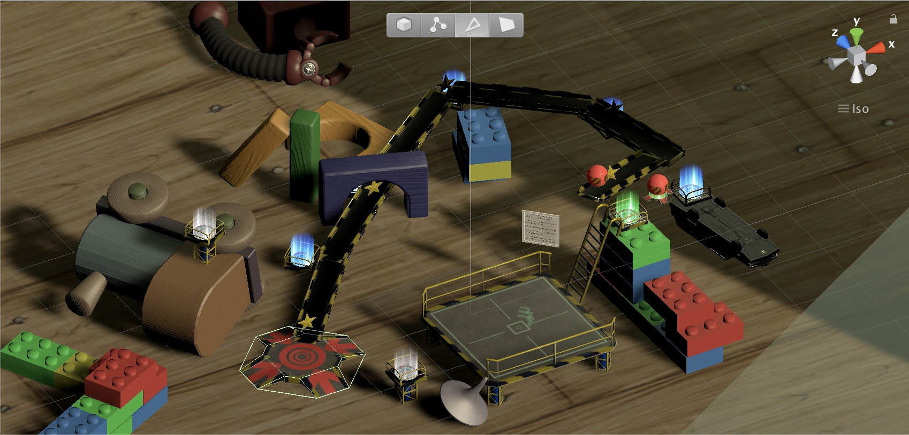

# Rube Goldberg Project

This project is part of [Udacity](https://www.udacity.com "Udacity - Be in demand")'s [VR Developer Nanodegree](https://www.udacity.com/course/vr-developer-nanodegree--nd017).

## Versions
- Unity 2017.2.0f3

## Rubric Checks
### Iniital Setup
* **SteamVR** - This project supports SteamVR and others via the VRTK
    * Within the hierarchy, the VRTK resources are located within the `VRHolder` resource
* **Environment Setup** (Play Zone) - The player is restricted to teleport zones for movement
    * These positions are the only places that they can release a ball, so there is reduced possibility of cheating

### Teleportation
* **Visual Indicator** - A teleporter stream is enabled from the left touch pad with a visual arc for the destination.
* **Player Translation** - The teleporter script is locked to valid teleport zones and maintains the same head distance from the ground upon teleport.

### Grabbing and Throwing
* **Ball Setup** - There are two balls to evaluate levels with.  The only one that will collect stars (*red colored*) is right next to the start platform for each level.  Another is available in the tool/item menu as a testing mechanism.  It will not collect stars or trigger an end of level if utilized.

### Object Menu
* **Menu Next/Previous** - A menu can be swiped left and right to change the next object to be instantiated using the right touchpad.
* **Object Spawning** - As soon as the user touches the touch pad an object will appear, but it is not instantiated until a touchpad press is detected.  To **remove** an object, the user can press the touchpad again while an object is being held (*but only with the right hand*).
* **Spawned Object Moving** - Objects can be grabbed and rotated/moved with the primary trigger.  Balls are unique types of objects that are described above.
* **Multiple Objects** - Objects (tools) have unique properties for interaction within a level.
    * Gray marble - use it to test tool layout at any time.
    * Metal plank - guides marble to next destination.
    * Industrial fan - give your marble an uphill push with a fan.
    * Trampoline - bounce a mable to heights unseen.
    * Teleporter - move a marble extra-human distances that are too far to bridge with traditional planks.
* **Hint Objects** - Each level has a set of hint objects included.  To see them, click and hold down the *left* grip button.  The headset will fade to another color and you will be unable to pick up objects while in hint mode.

### Grabbing and Throwing
* **Collectable** - Each level contains at least 2 collectables (stars) that disappear with an active ball and reappear when
the ball hits the floor.
* **Goal** - Each level contains a goal object, often at the lowest point in the level.  
   * When the ball touches the goal (through correct gameplay), fanfare is played and the player can transport to the exit teleport.
* **Scene Loading** - Between levels (scenes), the camera will fade to black.  Upon complete level load, the user will teleport to the next starting position and fade out of black.
* **Cheat Detection** - For testing of interaction placement, players can clone balls and let them roll from arbitary locations.  
    * Collectibles reset at each ball release and the only way to complete a level is gather all collectibles.  Therefore, balls released from non-start positions will not gather all collctibles. 
    * Further, the only valid start position is demarked with a different color teleport zone (*green*) compared to the normal teleporter color (*blue*).  The final teleport zone (*white*) will only transport the user once all collectibles are gone.
* **Levels** - Each level will vertically stack on other levels after completion.
    * **Hints** - To assist users in each level, they can activate a *hint mode* with the left grip.  Collectables are deactivated while in hint mode.

## Walkthrough
Snapshots of the overall and individual levels are 
included below.

* **Ovearall** - A view from above of all levels simultaneously
  loaded and visualized.
    * 
* **Level 1** - This level is a skillset building level that
  requires the user to understand plank placement and 
  how to manipulate the tools in a scene.
    * 
* **Level 2** - This level uses fans and planks to move
  a marble uphill to its destinatin.
    * 
* **Level 3** - This level is probably the most difficult 
  because it requires the use of some trampolines or 
  complicated planks to collect all stars.
    * 
* **Level 4** - The final level combines the need for all
  tools and provides an opportunity to use the teleport
  tool. 
    * 

### Hint Replay
Want to see all of the levels in action? You can enable hint 
testing to watch everything play through.  Just navigate in the editor to the location below, enable testing, and play the
game. 

### Level Warping
Okay, some levels are pretty challenging.  So, to see all of
them, the user can *quickly* triple click the left (*hint*) grip tool.
Details of the warp code are found in the `Assets/Scrtips/HintToggle.cs` script.
Upon the last release, the user will be teleported to the 
next level, starting as if the last level was completed.  This
is fun to view, but should be used sparingly, cheater ;-).

## Data Sources
* [winter hill 360 pano (skybox)](https://flic.kr/p/dU4VgM)
* [girl in backyard - persona photo](https://www.pexels.com/photo/girl-staring-at-the-sky-630770/)
* [toy character - persona photo](https://www.pexels.com/photo/shallow-focus-photography-of-luigi-plastic-figure-209679/)
* [fan fare sound](https://freesound.org/people/pel2na/sounds/321937/)
* [marble on metal](https://www.zapsplat.com/music/marble-roll-on-metal-1/), [marble on wood](https://www.zapsplat.com/music/glass-marble-roll-on-wooden-floor-2/)
* [wah-wah sound](https://freesound.org/people/Doctor_Jekyll/sounds/240195/)
* [hint power-up sound](https://freesound.org/people/Timbre/sounds/171595/)
* [grabbing sound](https://freesound.org/people/ihitokage/sounds/395332/)
* [boxfan sound](https://freesound.org/people/n_audioman/sounds/294460/)
* [trampoline sound](https://freesound.org/people/duckduckpony/sounds/130510/)

## User Feedback
Due to a compressed timeline, user testing was limited to a few
sessions when the game was almost complete.  Comments from
different users (most have some to significant VR experience)
is summarized below.

* **Challenging Levels** - Most levels presented at least moderate
  challenge to the users. While this may prevent progress
  through the game, this was somewhat acceptable.
* **Additional Training Required** - The information panels
  wither either insufficient or ignored by most users.  Instead,
  they often applied similar interaction methods from other 
  games but those patterns did not always map.
* **Tool Manipulation** - Some users wanted to be able to 
  manipulate tools other then by grabbing it.  This desire
  was localized to others who used the Oculus' touchpad
  more extensively, but it is worth noting.  Unfortunately,
  changing the grab and manipulation mechanics would violate
  the rubric standards for this game.

### Future Revisions
Some future revisions, were time available, are included 
below.

* **Additional FX/sound** - To keep the game interesting.
* **Easier demo mechanics** - Some users had a hard time 
  testing their creations, leading to some wasted/frustrated
  sessions.
